# OptimAI
OptimAI será un software diseñado para empresas involucradas dentro del e-commerce que utilizará algoritmos de optimización y técnicas  de IA y ML para diseñar y planificar rutas óptimas en tiempo real, tomando en cuenta múltiples variables como capacidades de carga de los vehículos, horarios y restricciones geográficas.

## Estructura repositorio
El repositorio tiene siete (7) carpetas principales:
* **info_drivers_ms:** Codigo necesario para ejecutar en docker el microservicio info_drivers_ms. Este microservicio gestiona la información relacionada con los conductores, como sus perfiles,
disponibilidad, y asignación de rutas.

* **routing_ms:** Codigo necesario para ejecutar en docker el microservicio routing_ms. Es el microservicio responsable de calcular las rutas optimizadas para la entrega. Utiliza
algoritmos de enrutamiento que consideran restricciones como capacidad del vehículo, tiempo y distancia.

* **evidence_images:** Evidencia en imagenes de despliegue en la nube y funcionamiento dentro de este.

* **modulo_bi_ms:** Codigo que extrae la informacion de un cliente de la base de datos de firestore donde se encuentra la informacion de los enrutamientos y los drivers asignados y retorna un conjunto de estadisticas o metricas utiles para que los usuarios puedan ver el comportamiento de sus enrutamientos de paquetes. Ademas este codigo esta alojado en un contenedor de docker. Este contenedor se subio a un artifact registry y se publica a traves de cloud run de GCP

* **optimia_ag:** Codigo del API Gateway que reune todos los microservicios expuestos anteriormente y lo aloja en una unica API. Ademas este codigo esta alojado en un contenedor de docker. Este contenedor se subio a un artifact registry y se publica a traves de cloud run de GCP

* **optimia_wa:** Codigo del componente de Front End para el consumo del usuario final. Ademas este codigo esta alojado en un contenedor de docker. Este contenedor se subio a un artifact registry y se publica a traves de cloud run de GCP

* **terraform-iac-optimia:** Codigo que configura un ambiente local de Terraform necesario para desplegar los diferentes servicios expuestos anteriormente dentro del cliente de Google Cloud

## Descripcion general del codigo por microservicio

### info_drivers_ms: 

El codigo a grandes rasgos crea un api en python utilizando flask y SQLacademy para poder recibir una peticion tipo POST y insertar los datos de la peticion (debe contener la informacion de los drivers que están disponibles para entregar paquetes) y los guarda dentro de una base de datos alojada en la nube. Mas especificamente una base de datos SQL en MySQL.

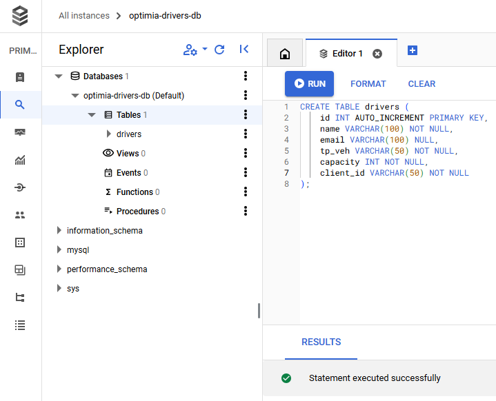

Este codigo se inserta dentro de un contenedor se sube a un artifact registry y se publica a traves de cloud run de GCP esto nos permite acceder a el microservicio a traves de un endpoint en la nube.

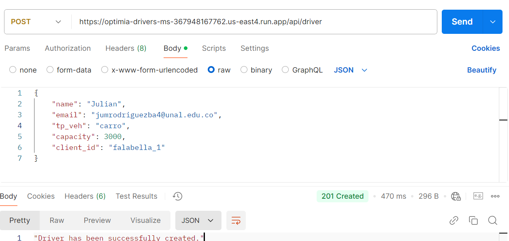

* Correcta inserción de los datos:

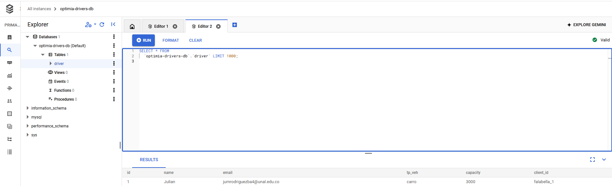

### routing_ms:

El codigo tiene dos aspectos principales:

  1. Logica de enrutamiento: Codigo que enruta y secuencia distintos paquetes optimizando distancia y tiempo de ejecucion teniendo en cuenta una flota de vehiculos especifica. Este codigo funciona como un api que recibe una peticion tipo POST con la informacion de los paquetes necesarios a enrutar y la cantidad de vehiculos a usar y reponde un Json con la informacion del enrutamiento. Adicional a esto estos datos resultantes se insertan dentro de una base de datos NoSQL alojada en Firestore en la nube.
  2.  Base de datos de enrutamientos: Esta base de datos esta alojada en GCP dentro de firestore y se pueden insertar documentos de los enrutamientos, esto lo hace por medio de una funcion en la nube (FaaS) que ejecuta el codigo en python necesario para insertar documentos dentro de esta base de datos, esto posteriormente queda disponible para acceder por medio de un endpoint dentro de Cloud run de GCP.
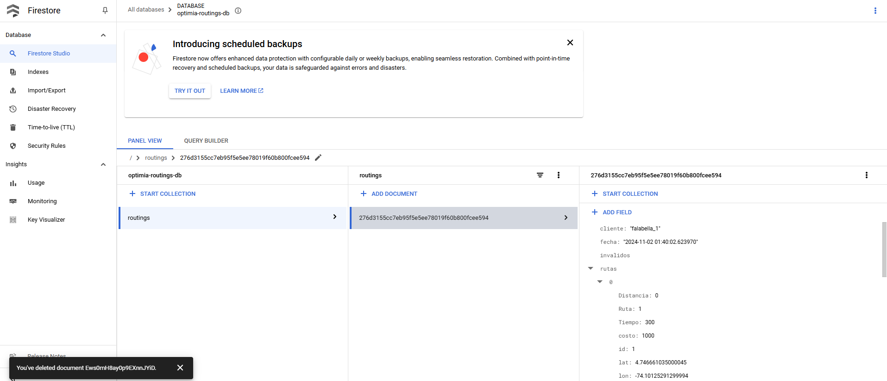

El condigo de enrutamiento al igual que el microservicio de informacion de drivers, tiene la funcion de hacer peticiones a la base de datos en firestore y almacenar los datos de los enrutamientos que hacen los clientes, ademas de que este codigo esta alojado en un contenedor de docker. Este contenedor se subio a un artifact registry y se publica a traves de cloud run de GCP

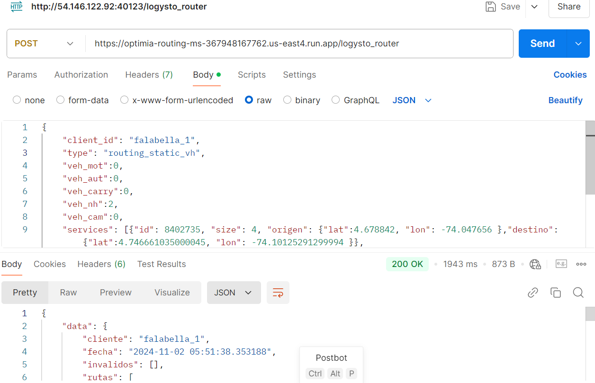

#### Registro Microservicios GCP Cloud Run

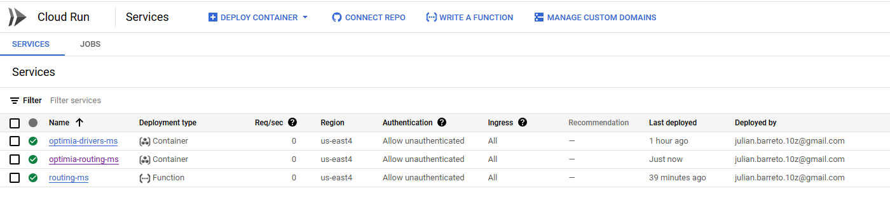

#### Registro Registry GCP Artifact Registry

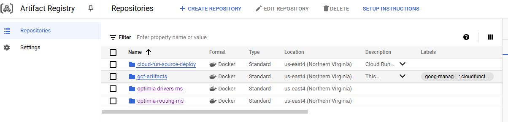

#### Registro Kubernets

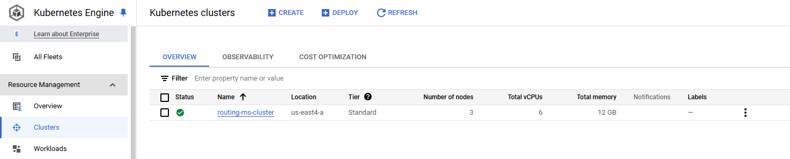

### modulo_bi_ms: 
Codigo que extrae la informacion de un cliente de la base de datos de firestore donde se encuentra la informacion de los enrutamientos y los drivers asignados y retorna un conjunto de estadisticas o metricas utiles para que los usuarios puedan ver el comportamiento de sus enrutamientos de paquetes. Ademas este codigo esta alojado en un contenedor de docker. Este contenedor se subio a un artifact registry y se publica a traves de cloud run de GCP

#### Registro Registry GCP Artifact Registry

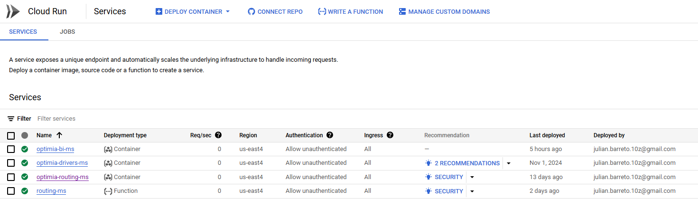

### optimia_ag: 
Codigo del API Gateway que reune todos los microservicios expuestos anteriormente y lo aloja en una unica API. Ademas este codigo esta alojado en un contenedor de docker. Este contenedor se subio a un artifact registry y se publica a traves de cloud run de GCP

#### Registro Registry GCP Artifact Registry

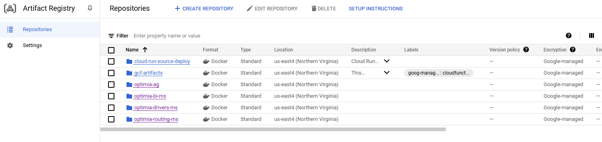

### optimia_wa: 
Codigo del componente de Front End para el consumo del usuario final. Ademas este codigo esta alojado en un contenedor de docker. Este contenedor se subio a un artifact registry y se publica a traves de cloud run de GCP

#### Registro Registry GCP Artifact Registry

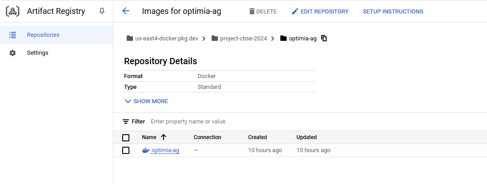

### terraform-iac-optimia: 
Codigo que configura un ambiente local de Terraform necesario para desplegar los diferentes servicios expuestos anteriormente dentro del cliente de Google Cloud